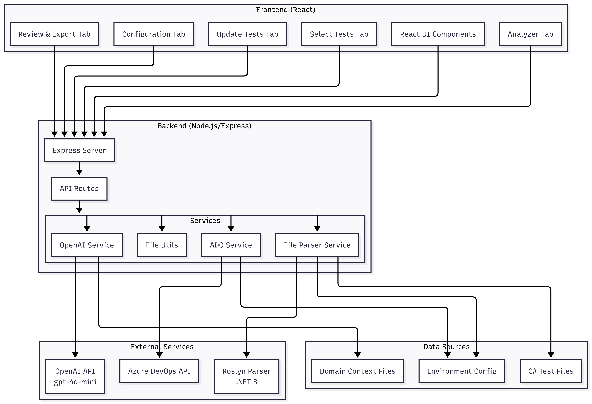
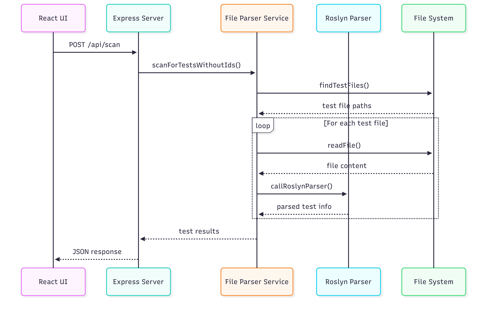
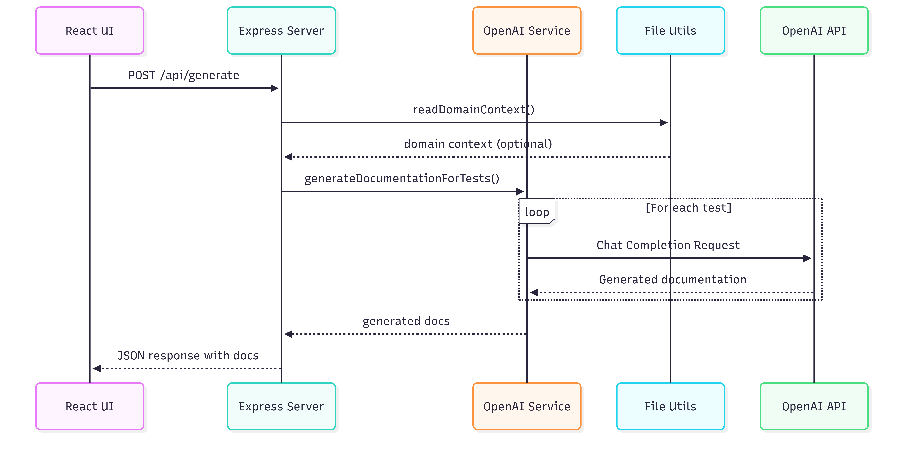
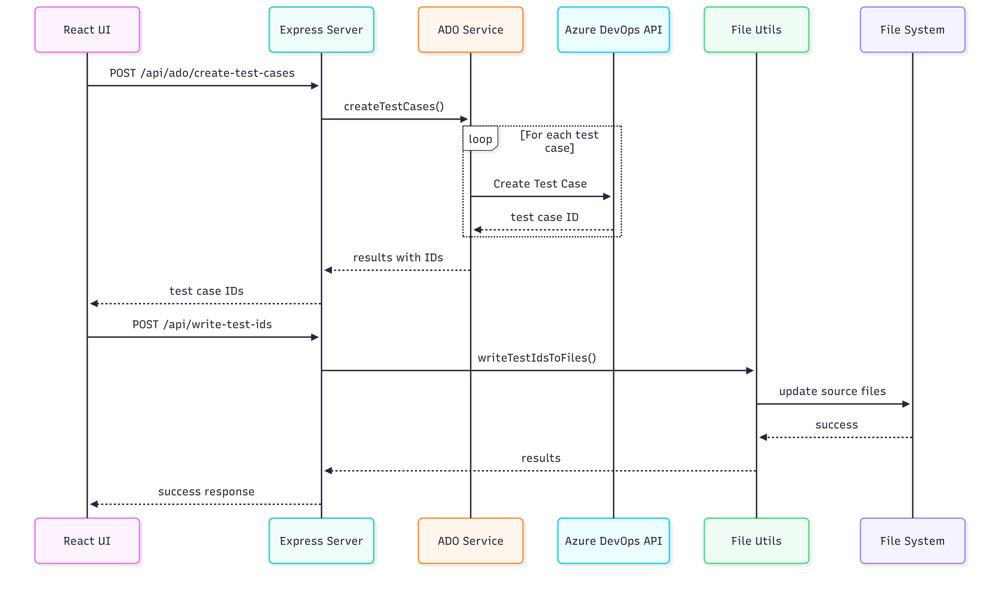
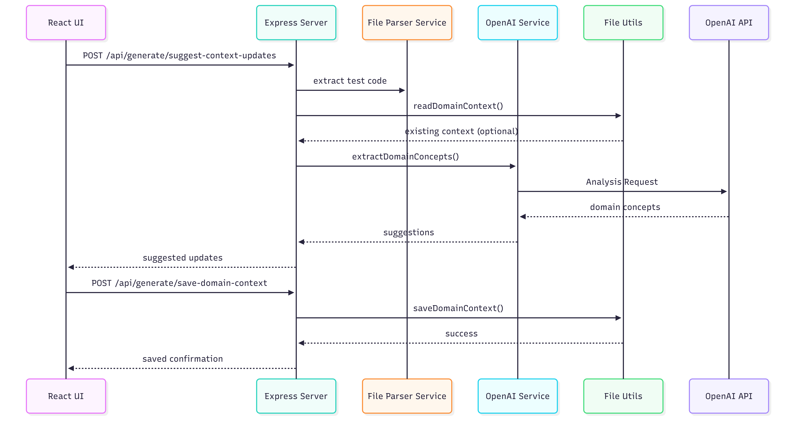

# TestMate Architecture Documentation

## System Overview

TestMate is a full-stack application that automates test documentation generation for C# NUnit test files. It combines a Node.js/Express backend, React frontend, a .NET 8 Roslyn-based C# parser, and OpenAI API integration to provide intelligent test documentation and Azure DevOps synchronization.

### High-Level Architecture



## Technology Stack

### Backend

- **Runtime**: Node.js (v14+)
- **Framework**: Express.js
- **Language**: JavaScript (ES6+)
- **Key Dependencies**:
  - `express`: Web server framework
  - `openai`: OpenAI API client
  - `cors`: Cross-origin resource sharing
  - `dotenv`: Environment variable management

### Frontend

- **Framework**: React
- **Language**: JavaScript (ES6+)
- **Build Tool**: Create React App
- **UI Libraries**: Lucide React (icons), Tailwind CSS (styling)

### C# Parser

- **Runtime**: .NET 8
- **Framework**: Microsoft.CodeAnalysis (Roslyn)
- **Language**: C#
- **Purpose**: Accurate parsing of C# syntax trees to extract test methods, attributes, and properties

### External Integrations

- **OpenAI API**: `gpt-4o-mini` model for AI-powered documentation generation
- **Azure DevOps REST API**: Test case management and synchronization

## Component Architecture

### Backend Services (`src/services/`)

#### `openaiService.js`

**Purpose**: Handles all interactions with OpenAI API for documentation generation.

**Key Methods**:

- `generateDocumentation(test, domainContext)`: Generates test documentation from code
- `generateStepsForTest({testCode, existingSteps, testName, domainContext})`: Generates steps for existing test cases
- `extractDomainConcepts(tests, existingContext)`: Extracts domain concepts from test code
- `generateManualTestSteps(testName, description, bulletPoints, domainContext)`: Generates steps from manual descriptions

**Configuration**:

- Model: `gpt-4o-mini`
- Temperature: 0.7 (generation), 0.5 (extraction)
- Max Tokens: 1000-4000 depending on operation
- Response Format: JSON

#### `adoService.js`

**Purpose**: Manages Azure DevOps test case operations.

**Key Methods**:

- `createTestCases(testCases, adoConfig, addTags, testTagsMap)`: Creates test cases in ADO
- `updateTestCase(adoConfig, testCaseId, {steps, description, tags})`: Updates existing test case
- `getTestCaseDetails(adoConfig, testCaseId)`: Retrieves test case details
- `getTestAnalysis(adoConfig, filters)`: Gets test analysis with linked bugs
- `testConnectivity(adoConfig)`: Tests ADO connection

**Features**:

- Mock mode support for testing without real ADO connection
- Batch operations for multiple test cases
- Tag management and synchronization

#### `fileParserService.js`

**Purpose**: Orchestrates C# file parsing using Roslyn parser.

**Key Methods**:

- `scanForTestsWithoutIds(repoPath, testPropertyName)`: Finds tests without ADO IDs
- `scanForTestsWithIds(repoPath, testPropertyName)`: Finds tests with ADO IDs
- `analyzeRepository(repoPath, testPropertyName)`: Comprehensive repository analysis
- `findTestFiles(repoPath)`: Discovers all test files
- `callRoslynParser(filePath, content, testPropertyName)`: Invokes Roslyn parser

**Roslyn Integration**:

- Spawns Roslyn parser process (executable or `dotnet run`)
- Communicates via JSON over stdin/stdout
- Handles Windows/Linux path differences
- Fallback mechanisms for parser availability

#### `fileUtils.js`

**Purpose**: File system operations and test ID management.

**Key Methods**:

- `writeTestIdsToFiles(testCaseIds, testPropertyName)`: Writes ADO IDs back to source files
- `readDomainContext(filePath)`: Reads domain context files
- `saveDomainContext(filePath, content)`: Saves domain context
- `generateMappingFile(testCaseIds, outputPath, adoConfig, testPropertyName)`: Creates mapping files
- `browseDirectory(dirPath)`: Directory browsing for file picker

### API Routes (`src/routes/`)

#### `scan.js`

- `POST /api/scan`: Scan for tests without ADO IDs
- `POST /api/scan-with-ids`: Scan for tests with ADO IDs
- `POST /api/analyze`: Comprehensive repository analysis
- `GET /api/browse-directory`: Browse directory structure

#### `generate.js`

- `POST /api/generate`: Generate documentation for selected tests
- `POST /api/generate/test-files-list`: Get list of all test files
- `POST /api/generate/generate-steps`: Generate steps for existing test case
- `POST /api/generate/suggest-context-updates`: Extract domain concepts
- `POST /api/generate/save-domain-context`: Save domain context file
- `POST /api/generate/manual`: Generate steps from manual description

#### `ado.js`

- `POST /api/ado/create-test-cases`: Create test cases in Azure DevOps
- `GET /api/ado/test-case/:testCaseId`: Get test case details
- `PATCH /api/ado/test-case/:testCaseId`: Update single test case
- `POST /api/ado/update-test-cases`: Batch update test cases
- `GET /api/ado/test-analysis`: Get test analysis with linked bugs

#### `files.js`

- `POST /api/write-test-ids`: Write test case IDs to source files
- `POST /api/generate-mapping-file`: Generate mapping file

#### `config.js`

- `GET /api/config/openai/status`: Check OpenAI configuration
- `GET /api/config/ado/status`: Check ADO configuration
- `POST /api/config/openai`: Configure OpenAI client
- `POST /api/config/ado/test`: Test ADO connectivity

### Frontend (`client/src/`)

#### `App.js`

**Main React Component** with tab-based navigation:

1. **Configuration Tab**: Repository path, OpenAI/ADO config, domain context setup
2. **Analyzer Tab**: Test coverage statistics, tag distribution, class breakdown
3. **Select Tests Tab**: Browse and select tests to document
4. **Review & Export Tab**: Review generated docs, edit steps, create in ADO, write IDs
5. **Update Tests in ADO Tab**: Update existing test cases in Azure DevOps

**Key Features**:

- File tree browser for test selection
- Inline step editing
- Domain context editor
- Real-time status updates
- Error handling and user feedback

### Roslyn Parser (`roslyn-parser/`)

#### `Program.cs`

**Entry Point**: Reads JSON from stdin, processes parsing request, outputs JSON response.

**Communication Protocol**:

- Input: JSON `ParsingRequest` via stdin
- Output: JSON `ParsingResponse` via stdout
- Error handling: Returns error in response JSON

#### `Services/CSharpParser.cs`

**Core Parser**: Uses Roslyn syntax tree analysis.

**Capabilities**:

- Extracts test methods with `[Test]` attribute
- Identifies test properties (e.g., `ADOTestCaseId`)
- Extracts categories/tags from methods and classes
- Handles async test methods (`async Task`)
- Excludes setup/teardown methods
- Supports class-level and method-level attributes

**Models**:

- `ParsingRequest`: File path, content, test property name
- `ParsingResponse`: Class name, test list, errors
- `TestInfo`: Test name, code, test case ID, categories

## Data Flow

### Test Scanning Flow



### Documentation Generation Flow



### Azure DevOps Sync Flow



### Domain Context Integration Flow



## Key Design Decisions

### Why Roslyn for Parsing?

**Decision**: Use Microsoft's Roslyn compiler platform via a separate .NET service.

**Rationale**:

1. **Accuracy**: Roslyn provides full syntax tree analysis, not regex-based parsing
2. **Reliability**: Handles complex C# syntax, attributes, and edge cases correctly
3. **Maintainability**: Official Microsoft tooling, well-documented and supported
4. **Future-proof**: Can easily extend to support more C# features

**Trade-offs**:

- Requires .NET 8 SDK installation
- Separate process communication overhead
- Additional build step required

### Why Separate .NET Service?

**Decision**: Roslyn parser as standalone executable, not embedded in Node.js.

**Rationale**:

1. **Language Compatibility**: Roslyn is C#-native, best used from C#
2. **Process Isolation**: Parser failures don't crash main server
3. **Resource Management**: Can be built once and reused
4. **Platform Support**: Works on Windows, Linux, macOS

**Communication**: JSON over stdin/stdout for simplicity and reliability.

### Domain Context Approach

**Decision**: Optional domain context files to enhance AI documentation quality.

**Rationale**:

1. **Accuracy**: AI uses correct domain terminology
2. **Consistency**: Standardized documentation across test suite
3. **Flexibility**: Optional feature, works without context
4. **Maintainability**: Single source of truth for domain knowledge

**Implementation**:

- Auto-detected from repository root (`domain-context.md`)
- Can be manually specified via UI
- Supports markdown, text, or JSON formats
- AI extracts and suggests updates from test code

### Mock Mode for ADO

**Decision**: Support mock mode for Azure DevOps operations.

**Rationale**:

1. **Development**: Test without real ADO connection
2. **Demo**: Show functionality without credentials
3. **CI/CD**: Run tests without ADO access
4. **Flexibility**: Easy toggle via environment variable

**Implementation**:

- Environment variable: `ADO_MOCK_MODE=true`
- Generates random test case IDs
- Simulates API responses
- No actual ADO API calls

## File Structure

```
test-mate/
├── server.js                    # Express server entry point
├── package.json                 # Backend dependencies
├── .env                         # Environment variables
│
├── src/
│   ├── middleware/
│   │   └── common.js           # Request logging, error handling, SSL config
│   │
│   ├── routes/
│   │   ├── scan.js             # Test scanning endpoints
│   │   ├── generate.js         # Documentation generation endpoints
│   │   ├── ado.js               # Azure DevOps integration endpoints
│   │   ├── files.js             # File operations endpoints
│   │   └── config.js             # Configuration endpoints
│   │
│   ├── services/
│   │   ├── openaiService.js     # OpenAI API integration
│   │   ├── adoService.js         # Azure DevOps API integration
│   │   └── fileParserService.js # C# file parsing orchestration
│   │
│   └── utils/
│       └── fileUtils.js         # File system utilities
│
├── client/                      # React frontend
│   ├── src/
│   │   ├── App.js              # Main application component
│   │   ├── index.js            # React entry point
│   │   └── index.css           # Global styles
│   ├── public/
│   │   └── index.html          # HTML template
│   └── package.json            # Frontend dependencies
│
├── roslyn-parser/              # .NET 8 C# parser
│   ├── Program.cs              # Entry point
│   ├── Services/
│   │   └── CSharpParser.cs     # Roslyn-based parser
│   ├── Models/
│   │   ├── ParsingRequest.cs   # Request model
│   │   ├── ParsingResponse.cs  # Response model
│   │   └── TestInfo.cs         # Test info model
│   └── RoslynParser.csproj     # .NET project file
│
├── tests/                       # Example test files
│   ├── API/
│   ├── Banking/
│   ├── Integration/
│   └── UI/
│
├── build-roslyn-parser.js      # Build script for Roslyn parser
├── start-app.bat               # Windows quick start script
├── README.md                   # User documentation
├── PROMPTS_DOCUMENTATION.md    # AI prompt documentation
└── ARCHITECTURE.md             # This file
```

## Environment Configuration

### Required Environment Variables

```env
# Server
PORT=3001

# OpenAI
OPENAI_API_KEY=your-openai-api-key

# Azure DevOps (optional)
ADO_ORGANIZATION_URL=https://dev.azure.com/YourOrganization
ADO_PROJECT_NAME=YourProjectName
ADO_TEST_PLAN_ID=123456
ADO_TEST_SUITE_ID=789012
ADO_PAT=your-personal-access-token
ADO_MOCK_MODE=false  # Set to 'true' for mock mode
```

## Build and Deployment

### Development Setup

1. **Backend**:

   ```bash
   npm install
   npm run build:roslyn  # Build Roslyn parser
   npm run dev           # Start with nodemon
   ```

2. **Frontend**:

   ```bash
   cd client
   npm install
   npm start             # Start React dev server
   ```

3. **Both**:
   ```bash
   npm run dev:all       # Start both concurrently
   ```

### Production Build

1. **Roslyn Parser**:

   ```bash
   npm run build:roslyn
   ```

2. **Frontend**:

   ```bash
   cd client
   npm run build
   ```

3. **Backend**:
   ```bash
   npm start
   ```

### Roslyn Parser Build

The Roslyn parser must be built before use:

- **Windows**: `roslyn-parser/bin/Release/net8.0/RoslynParser.exe`
- **Linux/Mac**: `roslyn-parser/bin/Release/net8.0/RoslynParser`

Fallback: If executable not found, uses `dotnet run` dynamically.

## Error Handling

### Backend Error Handling

- **Middleware**: Centralized error handler in `src/middleware/common.js`
- **Route Level**: Try-catch blocks in all route handlers
- **Service Level**: Errors propagated with context
- **User Feedback**: Structured error responses with messages

### Frontend Error Handling

- **API Calls**: Try-catch with user-friendly error messages
- **State Management**: Error state in React components
- **UI Feedback**: Alert components for errors and successes

### Roslyn Parser Error Handling

- **Input Validation**: JSON parsing with error responses
- **Syntax Errors**: Graceful handling of invalid C# code
- **Process Errors**: Error messages in response JSON

## Security Considerations

1. **API Keys**: Stored in environment variables, never committed
2. **CORS**: Configured for development, should be restricted in production
3. **File Access**: Validates paths to prevent directory traversal
4. **ADO PAT**: Stored securely in environment variables
5. **Input Validation**: All user inputs validated before processing

## Performance Considerations

1. **Roslyn Parser**: Built once, reused for all parsing operations
2. **Batch Operations**: ADO operations support batching
3. **Caching**: Domain context loaded once per request
4. **Async Operations**: Non-blocking I/O throughout
5. **File Scanning**: Efficient directory traversal with skip lists

## Future Enhancements

Potential areas for improvement:

1. **Caching**: Cache parsed test files and generated documentation
2. **Webhooks**: Real-time updates from Azure DevOps
3. **Multi-language Support**: Extend beyond C#/NUnit
4. **Plugin System**: Extensible architecture for custom integrations
5. **Database**: Persistent storage for test metadata
6. **Authentication**: User authentication and authorization
7. **Multi-tenant**: Support for multiple organizations/projects
